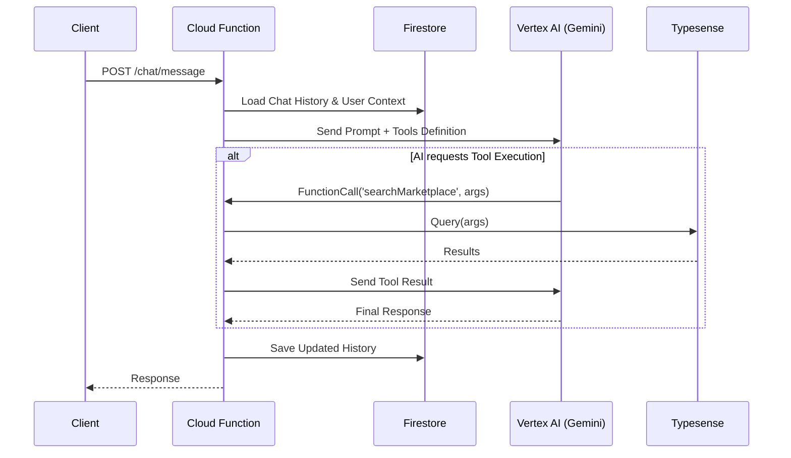

# Easy Islanders: Backend Architecture Blueprint

## 1. Executive Summary
This document outlines the architectural transition of "Easy Islanders" from a client-side prototype to a production-ready, serverless full-stack application on Google Cloud Platform (Firebase).

**Core Technologies:**
- **Runtime:** Node.js 20 (Google Cloud Functions Gen 2)
- **Database:** Firestore (NoSQL) + Redis (Memorystore for ephemeral geo-data)
- **AI:** Vertex AI (Gemini 1.5 Flash) via Server-Side SDK
- **Auth:** Firebase Authentication (Custom Claims for RBAC)
- **Search:** Typesense (Self-hosted on Cloud Run)
- **Background Jobs:** Cloud Tasks & Scheduler

---

## 2. Domain-Specific Data Modeling (Firestore)

### 2.1 Polymorphic Listings Strategy
We will use a **Single Root Collection (`listings`)** strategy. This enables unified search (e.g., "Everything in Kyrenia under £100") while preserving domain specificity via a `metadata` map.

**Schema Interface:**
```typescript
// Collection: /listings
interface Listing {
  id: string;
  ownerId: string; // Link to Business User
  domain: 'REAL_ESTATE' | 'AUTOMOTIVE' | 'EVENTS' | 'SERVICES';
  status: 'DRAFT' | 'ACTIVE' | 'SOLD' | 'SUSPENDED';
  
  // Shared Indexed Fields (for sorting/filtering)
  title: string;
  price: number;
  currency: 'GBP' | 'USD' | 'EUR' | 'TRY';
  location: {
    geohash: string; // Generated via 'geofire-common' for radius search
    lat: number;
    lng: number;
    district: string;
  };
  tags: string[]; // e.g., ["luxury", "family", "beachfront"]

  // Polymorphic Data (Not always indexed, used for display/AI context)
  metadata: {
    // Real Estate Specific
    bedrooms?: number;
    propertyType?: 'villa' | 'apartment';
    
    // Automotive Specific
    year?: number;
    transmission?: 'automatic' | 'manual';
    
    // Event Specific
    eventDate?: Timestamp;
    capacity?: number;
  };

  // Metrics
  stats: {
    views: number;
    saves: number;
  };
  
  createdAt: Timestamp;
  updatedAt: Timestamp;
}
```
*Indexing Strategy:* Composite Indexes for `domain + price`, `location.geohash + status`, and `tags + domain`.

### 2.2 Social Graph ("Connect") & Geospatial Engine
We will use a **Root Collection Strategy** for Posts, but **Sub-collections** for high-volume interactions (Vouches/Comments) to avoid document write limits.

**Geospatial Engine (Ephemeral):**
```typescript
// Collection: /anchors (Short-lived check-ins)
interface Anchor {
  id: string;
  userId: string;
  userSnapshot: { name: string; photo: string; level: number }; // Denormalized for fast read
  
  venueId: string; // Reference to a Place
  venueName: string;
  
  // Geospatial
  location: GeoPoint;
  geohash: string; // Precision 7 or 8
  message: string; // "Chilling at the bar"
  
  // Auto-Expiry
  createdAt: Timestamp;
  expiresAt: Timestamp; // Used by Firestore TTL Policy to auto-delete
}
```

**Aggregated Vibe Map:**
```typescript
// Collection: /hotzones (Read-optimized)
interface HotZone {
  zoneId: string; // e.g., "kyrenia_harbour"
  center: GeoPoint;
  radius: number;
  activeAnchorCount: number; // Real-time counter
  trendingLevel: 'low' | 'heating_up' | 'fire';
  lastUpdated: Timestamp;
}
```

**Social Interactions:**
- **`posts/{postId}`**: Core content.
- **`posts/{postId}/vouches/{userId}`**: Empty document. Existence = Liked. Prevents write contention on viral posts.
- **`posts/{postId}/comments/{commentId}`**: Standard comment thread.

---

## 3. Secure AI Architecture (Server-Side)

### 3.1 Architecture Diagram


### 3.2 Chat Persistence
- **`conversations/{sessionId}`**: Metadata (Agent ID, Last Active).
- **`conversations/{sessionId}/messages/{messageId}`**: Chronological chat log.

---

## 4. API & Service Layer Design

We will use **Express.js** hosted on Cloud Functions for a standard RESTful API structure.

### 4.1 Folder Structure
```
backend/
├── src/
│   ├── config/             # Env vars, Firebase Admin init
│   ├── controllers/        # Request handlers (req, res)
│   ├── services/           # Business logic (AI, Payments, Search)
│   ├── repositories/       # Database access layer (Firestore)
│   ├── middleware/         # Auth checks (RBAC), Validation
│   ├── routes/             # Express route definitions
│   └── types/              # Shared TypeScript interfaces
├── index.ts                # Entry point (exports "api" function)
```

### 4.2 Authentication & RBAC
Using Firebase Auth Custom Claims to avoid DB lookups on every request.
- **Claims:** `{ "role": "business" | "user" | "admin", "plan": "pro" }`
- **Middleware Example:**
  ```typescript
  export const isBusiness = (req, res, next) => {
    if (req.user.role !== 'business') return res.status(403).send('Unauthorized');
    next();
  };
  ```

---

## 5. Asynchronous Workflows & State Machines

### 5.1 Booking State Machine
Managed by **Cloud Tasks** (for timeouts) and **Firestore Triggers**.

| State | Trigger | Action |
| :--- | :--- | :--- |
| `PENDING_APPROVAL` | User Request | Email Business. Schedule 24hr Cloud Task. |
| `PAYMENT_PENDING` | Business Approve | Notify User. |
| `CONFIRMED` | Stripe Webhook | Cancel Cloud Task. Generate Ticket. |
| `EXPIRED` | Cloud Task | Release Inventory. Notify User. |

### 5.2 "Live Map" (The Vibe Check)
To avoid DB write hotspots from frequent location updates:
1.  **Ingest:** Client sends `{ lat, lng, activity }` to a lightweight endpoint every 5 mins.
2.  **Buffer:** Data pushed to **Redis (Memorystore)** or a sharded temporary Firestore collection.
3.  **Aggregate:** Scheduled Cloud Function (every 10 mins) reads buffer, calculates density, and updates `/hotzones`.

---

## 6. Infrastructure & Security

### 6.1 Firestore Security Rules
```javascript
rules_version = '2';
service cloud.firestore {
  match /databases/{database}/documents {
    
    // Listings: Public Read, Business Write (Own)
    match /listings/{listingId} {
      allow read: if true;
      allow create: if request.auth.token.role == 'business';
      allow update: if request.auth.uid == resource.data.ownerId;
    }

    // User Profiles: Private
    match /users/{userId} {
      allow read, write: if request.auth.uid == userId;
    }
    
    // Anchors: Public Read (Short-lived), User Write
    match /anchors/{anchorId} {
      allow read: if true;
      allow create: if request.auth != null;
    }

    // God Mode: Admin Only
    match /system_logs/{log} {
      allow read: if request.auth.token.role == 'admin';
    }
  }
}
```

### 6.2 Search Engine (Typesense)
Firestore lacks fuzzy search and complex filtering.
- **Deployment:** Typesense container on **Cloud Run**.
- **Sync:** Firestore Trigger (`onWrite` of `/listings`) pushes updates to Typesense.
- **Query:** API endpoints query Typesense directly for search/filtering.

### 6.3 Secrets Management
Use **Google Secret Manager**. Inject as env vars at runtime.
- `GEMINI_API_KEY`
- `TYPESENSE_API_KEY`
- `STRIPE_SECRET_KEY`
