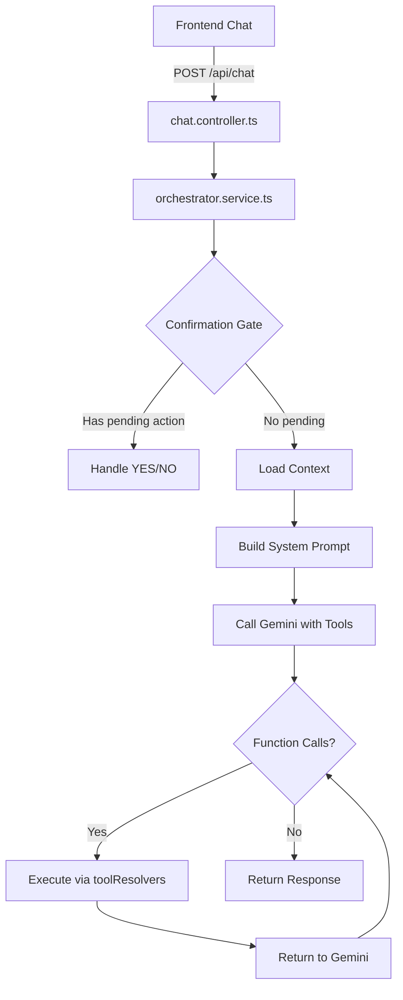

# Merve Architecture Deep Dive

## Complete Request Flow



---

## Key Components

| Component | File | Purpose |
|:----------|:-----|:--------|
| **Orchestrator** | `services/agent/orchestrator.service.ts` | Main entry point, manages flow |
| **Tool Definitions** | `utils/tools/definitions/all.ts` | What Gemini sees (49 tools) |
| **Tool Resolvers** | `services/tools/*.ts` | Actual implementations (55 functions) |
| **Data Access** | `repositories/merveListings.repository.ts` | Queries listings with Merve actions |

---

## Why "No Restaurants Found"

### Root Cause Analysis

The `searchRestaurants` tool calls:
```typescript
merveListingsRepository.searchByAction({
    actionType: 'order_food',  // ← MUST match action in listing
    name: args.name,
    area: args.area,
    ...
});
```

This queries:
```typescript
db.collection('listings')
    .where('merve.enabled', '==', true)
    .where('merve.actionTypesEnabled', 'array-contains', 'order_food')
```

### Possible Issues

1. **Listings don't have `merve.enabled: true`** → No results
2. **Listings don't have `order_food` in `merve.actions[]`** → No results
3. **Derived index `merve.actionTypesEnabled` is missing** → Falls back to scan, may still fail
4. **Listings have wrong `actionType`** (e.g., `restaurant` instead of `order_food`) → No match

---

## What Listings Need

For Merve to find a restaurant:

```json
{
  "id": "restaurant-123",
  "title": "Golden Fish Restaurant",
  "merve": {
    "enabled": true,
    "whatsappE164": "+905338123456",
    "actionTypesEnabled": ["order_food"],  // ← DERIVED INDEX
    "actions": [
      {
        "id": "action-1",
        "actionType": "order_food",        // ← MUST BE THIS
        "enabled": true,
        "dispatch": {
          "channel": "whatsapp",
          "toE164": "+905338123456"
        }
      }
    ]
  }
}
```

---

## Data Access Flow

```
Frontend → searchRestaurants tool
         → merveListingsRepository.searchByAction({ actionType: 'order_food' })
         → Firestore query: listings.where('merve.enabled', '==', true)
                                    .where('merve.actionTypesEnabled', 'array-contains', 'order_food')
         → If empty, fallback: listings.where('merve.enabled', '==', true).limit(200)
         → Filter in memory by action type
         → Return results
```

---

## Fix Checklist

1. **Verify listings have correct structure** in Firestore
   - [ ] `merve.enabled` = `true`
   - [ ] `merve.actions[]` contains `{ actionType: 'order_food', enabled: true }`
   - [ ] `merve.actionTypesEnabled` array contains `'order_food'`

2. **If `actionTypesEnabled` is missing**, create backfill script:
   ```typescript
   // Derive actionTypesEnabled from actions[]
   const actionTypes = listing.merve.actions
     .filter(a => a.enabled)
     .map(a => a.actionType);
   await doc.ref.update({ 'merve.actionTypesEnabled': actionTypes });
   ```

3. **Check admin UI** - when saving listing with Merve enabled:
   - Does it populate `merve.actionTypesEnabled`?
   - Does it use correct action types?

---

## Tool → Resolver Mapping (Verified)

| Tool Definition Name | Resolver Location | Query |
|:---------------------|:------------------|:------|
| `searchRestaurants` | `foodTools.searchRestaurants` | `order_food` |
| `searchMarketplace` | `searchTools.searchMarketplace` | Typesense |
| `bookService` | `serviceTools.bookService` | `book_service` / `request_service` |
| `orderHouseholdSupplies` | `miscTools.orderHouseholdSupplies` | `order_supplies` |
| `requestTaxi` | `taxiTools.requestTaxi` | `taxi_drivers` collection |

---

## Next Steps

1. **Check Firestore** for a sample listing with `merve.enabled=true`
2. **Verify action types** match what tools expect
3. **Add logging** to `merveListingsRepository.searchByAction` in dev
4. **Create backfill script** if `actionTypesEnabled` is missing
