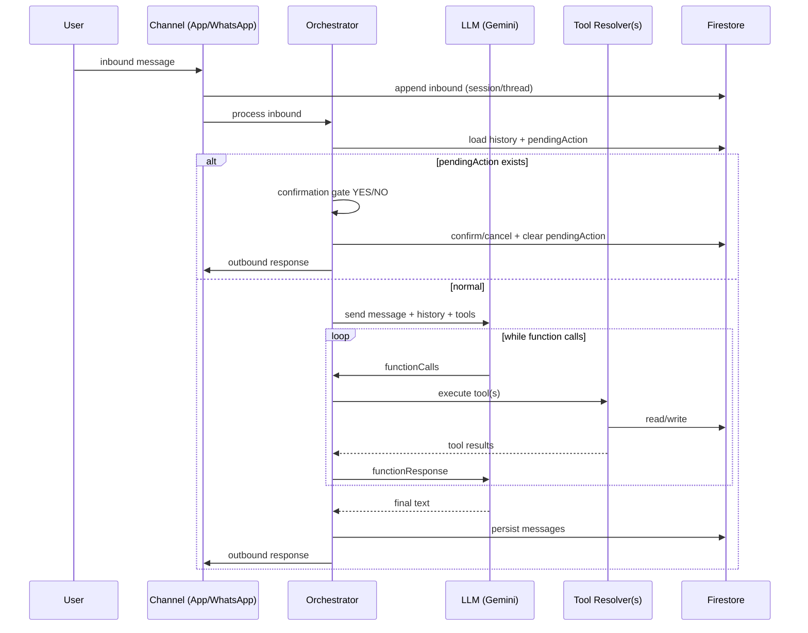
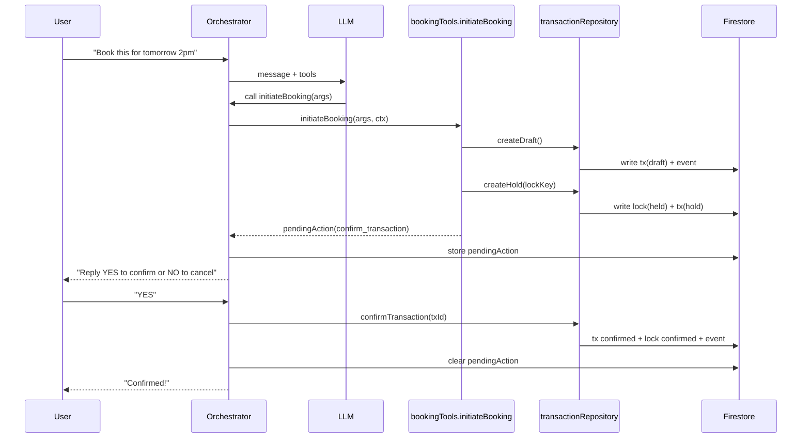

# Merve Architecture Deep Dive (Easy Islanders / AskMerve)

This document is an internal, code-grounded deep dive into how “Merve” works in this repository: the orchestration layer, tool system, confirmation/ledger primitives, listing integration, and channel adapters (App + WhatsApp). It is written to help engineers understand the *actual* implementation today, the *intended* target architecture, and the *current transition state* (because parts of the system are mid-refactor).

> Scope note: This doc explains architecture and runtime behavior. It intentionally does not include secrets, operational credentials, or any user PII.

---

## Table of contents

1. What “Merve” is (the real definition)
2. Glossary
3. System overview (layers and boundaries)
4. Runtime entrypoints (HTTP + Functions)
5. The three orchestrators (and why you have three)
6. Conversation state: `chatSessions` vs `threads` (canonical model migration)
7. Tool system design: declarations vs resolvers
8. Tool execution loop (function-calling runtime)
9. Safety primitives: confirmation gate + pending actions
10. Booking architecture: legacy booking docs vs execution ledger
11. Execution ledger internals: transactions, locks, idempotency, invariants
12. Dispatch architecture: WhatsApp (Twilio), templates, dedupe
13. Merve listing integration: per-listing actions model (`merve.actions[]`)
14. Search/discovery: Typesense + Mapbox
15. Taxi dispatch system (broadcast + driver accept loop)
16. Market configuration: the Merve Controller and tool policies
17. Observability & operability: logs, alerts, idempotency, failure modes
18. Testing map (what exists, what to add)
19. Architecture gaps / mismatches (current state)
20. Recommended consolidation plan (how to get to “one true path”)

---

## 1) What “Merve” is (the real definition)

In this codebase, **Merve is not a UI chatbot and not “the LLM.”** Merve is the *backend orchestration layer* that:

- **Interprets intent** (via Gemini with function calling)
- **Selects and executes tools** (backend-controlled, typed “capabilities”)
- **Enforces safety/commitment rules** (confirmation gates, idempotency)
- **Persists conversation and execution state** (Firestore)
- **Integrates with real-world channels** (WhatsApp, merchant workflows, taxi dispatch)

You can summarize the architecture as:

> **LLM suggests actions; backend executes; backend is authoritative for commitments.**

This is crucial for trust: the LLM cannot “hallucinate” that a booking is confirmed or a taxi is dispatched unless the backend actually wrote the state and/or sent messages via integrations.

---

## 2) Glossary

**Agent / Orchestrator**
- The code that runs the LLM, drives tool calling, enforces confirmation, and returns responses.

**Tool**
- A named capability exposed to Gemini via function calling. Implemented by a resolver function in backend code.

**Tool declaration**
- A Gemini `FunctionDeclaration` schema (name, description, parameter schema). Lives under `functions/src/utils/tools/definitions/*`.

**Tool resolver**
- The code implementation of a tool. Lives under `functions/src/services/tools/*` and exported via `functions/src/services/tools/index.ts`.

**Pending action**
- A structured object representing “a proposal the user must confirm” (YES/NO). Stored on the conversation container (currently either session doc or thread doc depending on orchestrator path).

**Confirmation gate**
- The first thing the orchestrator runs on an inbound message: if there is a pending action, interpret the inbound message as YES/NO/other and confirm/cancel or remind.

**Execution ledger**
- A transaction system used for booking-type commitments: draft → hold → confirm, with concurrency locks and idempotency. Implemented in `functions/src/repositories/transaction.repository.ts`.

**Thread**
- The new canonical conversation spine (`threads/{threadId}`) used to unify channels (App/WhatsApp/Discover) with one model. Implemented in `functions/src/services/domains/conversations/*`.

**Chat session**
- The legacy conversation container (`chatSessions/{sessionId}`) used by the older web chat controller and also still used by some services (including the Merve orchestrator service).

**Merve listing integration**
- A per-listing namespace (`listing.merve`) that declares whether a listing is tool-actionable and how to dispatch actions (templates, WhatsApp targets, supported action types).

---

## 3) System overview (layers and boundaries)

At a high level, the system is split into:

### A) Clients

- **Web app** (`src/`)
  - Calls backend chat via `src/services/geminiService.ts` → `POST {VITE_API_URL}/chat/message`
  - Provides admin UI for controlling Merve and configuring listing tool integration.

### B) API layer / Cloud Functions

- Entry: `functions/src/index.ts`
  - Exposes multiple HTTP functions (`api`, `apiV1`, `jobsApi`, etc.)
  - Exposes triggers (listing sync, transaction events, etc.)
  - Exposes scheduled workers (expiry/invariants)

### C) Orchestration layer (“Merve backend”)

There are multiple orchestration implementations (see section 5):
- Controller-based chat orchestrator
- Service-based Merve orchestrator
- Thread-based unified orchestrator (router)

### D) Tool layer

- Declarations: `functions/src/utils/tools/definitions/*`
- Resolvers: `functions/src/services/tools/*`

### E) Data & integrations

- Firestore (core state)
- Typesense (search index)
- Mapbox (geocoding / POI search)
- Twilio (WhatsApp messaging)

---

## 4) Runtime entrypoints (HTTP + Functions)

Understanding how Merve “gets invoked” starts with the entrypoints.

### Web chat entrypoint (legacy path)

Frontend: `src/services/geminiService.ts` calls:
- `POST ${VITE_API_URL}/chat/message`
  - Sends: `{ message, agentId, language, sessionId }`
  - Includes Firebase Auth ID token in `Authorization: Bearer ...`

Backend route mapping:
- `functions/src/routes/index.ts` mounts `/chat/message` and routes to:
- `functions/src/controllers/chat.controller.ts` → `handleChatMessage()`

This controller currently contains a full orchestration loop (prompting + tools + persistence + confirmation).

### WhatsApp entrypoint (channel adapter)

WhatsApp messages enter via Twilio webhooks (controller not expanded here), and are handled by:
- `functions/src/services/channels/whatsapp.service.ts` → `handleConsumerMessage()`

That service:
- gets/creates a WhatsApp session (`whatsappSessions/{wa:+E164}`)
- writes to new canonical `threads` (compat period)
- calls the service orchestrator `processMessage()` (not the legacy controller)
- sends reply via Twilio

### Jobs API / other endpoints

You also have:
- `functions/src/http/api.ts` mounted as `jobsApi` in `functions/src/index.ts`

This is more about job/execution API and less about the chat interface, but it’s relevant because it’s part of the “execution layer” roadmap.

---

## 5) The three orchestrators (and why you have three)

You currently have **three orchestration-related modules** in play:

1) `functions/src/controllers/chat.controller.ts` (legacy web chat orchestrator)
2) `functions/src/services/agent/orchestrator.service.ts` (Merve orchestrator service)
3) `functions/src/services/orchestrator/unified.service.ts` (unified thread-based orchestrator/router)

This is not unusual during a migration; the important thing is understanding which path is active for which channel, and what differences exist.

### 5.1 Legacy controller orchestrator (`chat.controller.ts`)

This is the “classic” pattern:
- HTTP handler does auth, loads context, runs gate, invokes LLM, tool loop, saves messages, returns response.

Key characteristics:
- Uses `chatSessions` as the conversation container (`chatRepository`).
- Implements its own confirmation gate in the controller itself.
- Implements extra tool-specific logic in-line (notably taxi args enrichment).
- Does **not** centrally enforce per-market tool enablement via `merveConfigRepository` in the same standardized way as the service orchestrator does.

### 5.2 Merve orchestrator service (`services/agent/orchestrator.service.ts`)

This is intended to be channel-agnostic (“used by app chat, WhatsApp, Discover” per header comment).

Key characteristics:
- Still uses `chatSessions` + `chatRepository` for history and pendingAction storage.
- Builds systemInstruction using `functions/src/utils/systemPrompts.ts`.
- Registers tools from `ALL_TOOL_DEFINITIONS`.
- Executes tool loop via `toolResolvers` (which is the modular tool system under `functions/src/services/tools/*`).
- **Enforces tool enablement** per market using `merveConfigRepository.isToolEnabled(marketId, toolName)` on every tool call before execution.

This is the first place where “Merve Controller” config materially changes runtime behavior.

### 5.3 Unified orchestrator (`services/orchestrator/unified.service.ts`)

This is the direction you’re moving toward:

> inbound message → append to canonical thread → `processInbound()` → outbound messages → append → send

Where channels become adapters that never call the LLM directly.

Key characteristics:
- Uses the new `threads` model (see section 6).
- Routes based on `thread.threadType` into:
  - Merve agent (general consumer)
  - business agent (consumer↔business chat)
  - ops agent (business owner/staff ops)
  - dispatch handler (driver messages)
- Today, `runMerveAgent()` and `runBusinessAgent()` delegate to the Merve orchestrator service’s `processMessage()` for actual LLM behavior.

This means the “unified orchestrator” currently centralizes routing and the thread model, but the LLM execution is still session-based behind the scenes.

---

## 6) Conversation state: `chatSessions` vs `threads` (canonical model migration)

You are mid-migration from:

- **Legacy sessions**: `chatSessions/{sessionId}` + `chatSessions/{sessionId}/messages`

to:

- **Canonical threads**: `threads/{threadId}` + `threads/{threadId}/messages`

### 6.1 The legacy `chatSessions` model

Implemented in:
- `functions/src/repositories/chat.repository.ts`

It provides:
- `getOrCreateSession()`
- `getHistory()` (Gemini history format)
- `saveMessage()`
- `setPendingAction()`, `getPendingAction()`, `clearPendingAction()`

Pending action kinds supported here:
- `confirm_transaction` (booking ledger)
- `confirm_order` (food order)
- `confirm_service` (service request)

This model is “sessionId-based” and not explicitly channel-aware; it’s used by web chat and the service orchestrator.

### 6.2 The new `threads` model

Types:
- `functions/src/types/thread.types.ts`

Repo:
- `functions/src/services/domains/conversations/thread.repository.ts`
- `functions/src/services/domains/conversations/threadId.service.ts`

Important design choices:

1) **Deterministic thread IDs**
   - `computeThreadId()` hashes a canonical key so the same actor/thread type maps to the same thread ID.
   - This prevents duplicates and makes “one conversation spine” feasible.

2) **Idempotent message appends**
   - `appendMessage()` uses a `messageIdempotency` collection when `channelMessageId` is provided (e.g., Twilio MessageSid).
   - This is essential because webhooks are at-least-once and can replay.

3) **Thread state and pending actions**
   - Threads have `state` (`idle`, `awaiting_confirmation`, `executing`)
   - Threads can have a `pendingAction` (thread-based variant, currently smaller/future-oriented)

### 6.3 Why threads are “the right” abstraction

Threads let you:
- unify App + WhatsApp + future channels
- centralize safety and routing decisions
- have a durable, queryable “conversation spine”
- remove “controller-specific” session semantics and move to domain-driven conversation handling

The system is already partially using threads (WhatsApp writes to threads “for compat period”), but the LLM executor is not fully thread-native yet.

---

## 7) Tool system design: declarations vs resolvers

Tools are split into two halves:

1) **Tool declarations**: Gemini schema that defines *what the model is allowed to call* and with what arguments.
2) **Tool resolvers**: actual backend code that runs *when the model calls the tool*.

This split is deliberate:
- The model sees declarations only (names, descriptions, JSON schema).
- The backend controls what happens (auth, validation, side effects, retries).

### 7.1 Tool declarations (Gemini FunctionDeclaration)

Location:
- `functions/src/utils/tools/definitions/*.ts`

Aggregation:
- `functions/src/utils/tools/definitions/all.ts` exports `ALL_TOOL_DEFINITIONS`

Example: booking tools
- `functions/src/utils/tools/definitions/booking.tools.ts`
  - `initiateBooking`
  - `createPaymentIntent`
  - `scheduleViewing`

This is the “contract surface” for the LLM.

### 7.2 Tool resolvers (modular implementation)

Location:
- `functions/src/services/tools/*.ts`

Aggregation:
- `functions/src/services/tools/index.ts` merges each module into:
  - `export const toolResolvers = { ...taxiTools, ...bookingTools, ...searchTools, ... }`

This is the “execution surface” for the backend.

### 7.3 Tool context normalization

To support both old and new calling patterns, tools accept either:
- a userId string (legacy)
- a context object with `userId`, `sessionId`, `channel`, `location`, etc.

Helpers:
- `functions/src/services/tools/toolContext.ts`
  - `asToolContext()`
  - `requireToolUserId()`

This is a key refactor enabling step: once everything uses tool context, you can make tools channel-aware, market-aware, and thread-aware without changing every tool signature repeatedly.

---

## 8) Tool execution loop (function-calling runtime)

Both orchestrators implement the same core loop:

1) Create Gemini model instance with:
   - systemInstruction
   - tool declarations
   - `FunctionCallingMode.AUTO`
2) Start a chat with recent history.
3) Send user message.
4) While the model returns `functionCalls()`:
   - Execute each call in backend by name
   - Collect function responses
   - Send tool outputs back to Gemini
5) Return the final model text.

### 8.1 Service orchestrator tool loop specifics

In `functions/src/services/agent/orchestrator.service.ts`:
- `tools: [{ functionDeclarations: ALL_TOOL_DEFINITIONS }]`
- Each function call:
  - finds resolver from `toolResolvers[toolName]`
  - checks tool enablement using `merveConfigRepository.isToolEnabled(marketId, toolName)`
  - executes resolver with a rich context object
  - if tool result includes `pendingAction`, stores it via `chatRepository.setPendingAction()`

This last step (storing pendingAction) is a critical part of safety: tools don’t directly “commit,” they can create proposals.

### 8.2 Legacy controller tool loop specifics

In `functions/src/controllers/chat.controller.ts`:
- Similar function call loop, but with more hardcoded branching:
  - special casing taxi dispatch
  - capturing `taxiRequestId` into message metadata for the UI
  - returning `mapLocation` in the response for UI pins

This is why you want to consolidate onto one orchestrator eventually: controller-based special casing tends to accumulate and diverge from channel-agnostic behavior.

---

## 9) Safety primitives: confirmation gate + pending actions

The confirmation gate is the system’s “trust firewall.”

### 9.1 What the confirmation gate does

Before the LLM sees a message:

- If there is an outstanding proposal awaiting confirmation:
  - Interpret inbound message as YES or NO (with a small multilingual list).
  - If YES:
    - confirm/dispatch in backend
    - clear pending action
    - write confirmation message to history
    - return confirmation response
  - If NO:
    - cancel/release hold if applicable
    - clear pending action
    - return cancellation response
  - Else:
    - remind user that the system is waiting for confirmation

This ensures you never accidentally move from “proposal” to “commitment” without an explicit user instruction.

### 9.2 Session-based pending actions (`chatSessions`)

Type:
- `functions/src/repositories/chat.repository.ts` → `PendingAction`

Storage:
- `chatSessions/{sessionId}.pendingAction`

Kinds:
- `confirm_transaction` (booking ledger transaction)
- `confirm_order` (food order)
- `confirm_service` (service request)

Gate implementations:
- `functions/src/controllers/chat.controller.ts`
- `functions/src/services/agent/orchestrator.service.ts`

### 9.3 Thread-based pending actions (`threads`)

Thread type:
- `functions/src/types/thread.types.ts` → `PendingAction` (thread variant)

Gate implementation:
- `functions/src/services/orchestrator/unified.service.ts`

Note: thread pendingAction kinds currently differ from session ones; this is a sign that the thread model is oriented toward the execution ledger and ops flows, while “food order” and “service request” are currently built around `chatSessions` gating.

### 9.4 Expiration behavior

There are two “expiration layers”:

1) **UX expiry buffer** in the gate logic (e.g., 30s buffer): don’t attempt confirm if it’s basically expired to avoid races.
2) **Authoritative expiry** in the execution system:
   - Booking holds expire via scheduled worker (see section 11.5)
   - Food/service proposals expire by local `holdExpiresAt` semantics (not the ledger, today)

---

## 10) Booking architecture: legacy booking docs vs execution ledger

There are two booking-ish patterns in the repo:

### 10.1 “Simple booking document” pattern

Tool: `bookingTools.createBooking()` in `functions/src/services/tools/booking.tools.ts`

Behavior:
- Creates a `bookings/{bookingId}` document with status `"payment_pending"`.
- Returns a “receipt”-style payload for UI.

This looks like an early or simplified booking flow; it is not concurrency-safe (no locks) and it doesn’t use the execution ledger.

### 10.2 “Execution ledger booking” pattern (recommended)

Tool: `bookingTools.initiateBooking()` in `functions/src/services/tools/booking.tools.ts`

Behavior:
- Resolves business context (`resolveBusinessId()` in `functions/src/services/tools/booking-ledger.tools.ts`)
- Creates a draft transaction in `businesses/{businessId}/transactions/{txId}`
- Acquires a slot lock in `businesses/{businessId}/resourceLocks/{lockKey}`
- Returns:
  - `awaitingConfirmation: true`
  - `transactionId`
  - `holdExpiresAt`
  - `pendingAction` (kind: `confirm_transaction`)
- The orchestrator stores pendingAction and prompts user to reply YES/NO.

This is the architecture described in your “master architecture and roadmap” doc: a real execution model with holds, confirmation, idempotency, and auditability.

### 10.3 Viewing requests

Tool: `bookingTools.scheduleViewing()` in `functions/src/services/tools/booking.tools.ts`

Behavior:
- Creates `viewingRequests/{id}` in Firestore.
- If listing has an agent/owner WhatsApp contact, sends a WhatsApp message via Twilio.

This is a different type of “booking”: it’s essentially a lead workflow rather than a capacity/slot lock. It’s appropriate that it doesn’t use the ledger (unless you later introduce appointment capacity).

### 10.4 Payments

Tool declaration exists: `createPaymentIntent` in `functions/src/utils/tools/definitions/booking.tools.ts`

Resolver: `bookingTools.createPaymentIntent()` in `functions/src/services/tools/booking.tools.ts`

It delegates to `paymentService.createPaymentIntent()` (Stripe not fully wired for production per comments). This is more of a payment integration placeholder right now.

---

## 11) Execution ledger internals: transactions, locks, idempotency, invariants

This is the most “system-designed” part of the repo: it’s where you treat real-world commitments like distributed systems problems.

### 11.1 Collections and authoritative state

Transactions live under businesses:

- `businesses/{businessId}/transactions/{txId}`
- `businesses/{businessId}/transactions/{txId}/events/{eventId}`
- `businesses/{businessId}/resourceLocks/{lockKey}`
- `idempotency/{key}` (global)

Core repo:
- `functions/src/repositories/transaction.repository.ts`

### 11.2 Transaction lifecycle

The state machine implemented includes:
- `draft`
- `hold`
- `confirmed`
- `cancelled`
- `expired`

Key invariants enforced in code:
- You can only hold a `draft`.
- You can only confirm a `hold`.
- You can’t confirm if `holdExpiresAt` is in the past.
- Locks are either `held` or `confirmed`, and an unexpired `held` lock blocks new holds.

### 11.3 Lock key derivation (capacity model)

In `functions/src/services/tools/booking-ledger.tools.ts`, lock keys are derived as:

`{businessId}:offering:{offeringId}:{YYYY-MM-DDTHH:MM}`

And time is normalized to slot boundaries. This is intentionally extensible to capacity tokens later:

`...:token:{N}`

This is a good design: it lets you add capacity without migrating existing keys.

### 11.4 Idempotency design

The transaction repository uses a dedicated `idempotency` collection so you can safely retry operations (especially important in Cloud Functions, webhook retries, and client retries).

Examples of idempotency keys used:
- Draft: `tx_draft:{businessId}:{idempotencyKey}`
- Hold: `tx_hold:{transactionId}:{idempotencyKey}`
- Confirm: `tx_confirm:{transactionId}:{idempotencyKey}`
- Release: `tx_release:{transactionId}:{idempotencyKey}`

This matters because:
- Cloud Functions are at-least-once in many contexts (triggers)
- Network calls can be retried
- Users can double-tap “confirm”

Idempotency ensures “exactly-once effects” at the application level even if the infrastructure is “at-least-once.”

### 11.5 Scheduled expiry worker

`functions/src/scheduled/expiry.scheduled.ts` runs every minute to:
- query expired holds across all businesses (`collectionGroup('transactions')`)
- call `transactionRepository.expireHold(businessId, txId)`

You explicitly note that Firestore TTL is not immediate and is not correctness-authoritative. That’s a mature production stance.

### 11.6 Invariant checkers + alerts

`functions/src/scheduled/invariants.scheduled.ts` runs periodic audits:

- **Single hold per lock** (CRITICAL)
- **Confirmed transaction has exactly one confirmed event** (ERROR)
- **No orphan locks** (WARNING, auto-heal by deletion)

Alerts are written to `systemAlerts`, and you log invariant checks via `logSystem()`.

This creates an “operable” system: failures are detectable, inspectable, and in some cases auto-healable.

### 11.7 Transaction event trigger notifications

`functions/src/triggers/transaction-events.triggers.ts` listens for new events and sends WhatsApp notifications.

Important reliability detail:
- Firestore triggers are at-least-once, so you use `notificationsSent` with a dedupe key:
  - `{txId}:{eventId}:{notificationType}:{recipient}`

This avoids double-sending WhatsApp messages, which would destroy trust.

---

## 12) Dispatch architecture: WhatsApp (Twilio), templates, dedupe

Dispatch is where the system touches the real world (merchants, drivers, users).

### 12.1 Twilio gateway

Canonical implementation:
- `functions/src/services/integrations/twilio/twilio.gateway.ts`

Wrapper shim:
- `functions/src/services/twilio.service.ts` (deprecated shim, exports canonical)

Key behaviors:
- Validates Twilio env vars exist
- Sends message to `whatsapp:{E164}`
- Logs outbound message to `whatsappMessages` collection (best-effort)

### 12.2 Template rendering

Template helper:
- `functions/src/services/domains/merve/template.ts` → `renderTemplate(template, vars)`

Features:
- Replaces `{var}` tokens.
- Adds snake_case aliases for camelCase variables to maintain compatibility.

This is used heavily in food/service tools where:
- per-listing template override can exist
- per-market default template can exist
- otherwise fallback templates exist in code

### 12.3 Dispatch: food orders and service requests

These are “proposal → confirm → dispatch” patterns:

- Proposal record created in Firestore:
  - `food_orders/{orderId}`
  - `service_requests/{requestId}`
- Pending action stored in conversation container
- On confirmation, WhatsApp message sent to listing’s resolved WhatsApp target

This is a consistent architecture that matches your “trust guarantees”:
- Merve does not dispatch until user says YES.

### 12.4 Outbound dedupe at the channel level

For WhatsApp inbound processing, you also maintain:
- `webhookIdempotency` in `functions/src/services/channels/whatsapp.service.ts`

It uses Twilio MessageSid to prevent duplicate processing of the same inbound message.

Separately, in the thread system you also have message idempotency:
- `messageIdempotency` based on `threadId:channelMessageId`

These are layered protections and are valuable during the migration period.

---

## 13) Merve listing integration: per-listing actions model (`merve.actions[]`)

The “Merve integration” namespace on listings is the contract between:

- what exists in your catalog/listings
- what Merve is allowed to do with that listing
- where dispatch goes and how messages look

### 13.1 Backend type model

Types:
- `functions/src/types/merve.ts`

Core fields:
- `merve.enabled`
- `merve.whatsappE164` (fallback dispatch target)
- `merve.actions[]` (source of truth)
  - actionType (order_food, book_service, etc.)
  - enabled
  - dispatch config (toE164 override, template override)
  - data kind (menuItems/services/tickets/roomTypes) for subcollection ingestion
  - optional tags and notes

### 13.2 Legacy fallback model

You still support:
- `merve.toolType` (restaurant/provider/activity/stay)
- `merve.dispatchTemplate`

Normalization happens in:
- `functions/src/repositories/merveListings.repository.ts`

If `actions[]` is missing and `toolType` exists, it derives a set of actions based on toolType and uses the legacy dispatch template if present.

### 13.3 How tool implementations use it

Food and service tools:
- enforce `listing.merve.enabled`
- require the actionType to be enabled
- resolve WhatsApp target with:
  - per-action `dispatch.toE164` if present
  - else listing-level `whatsappE164`
- choose template with:
  - per-action `dispatch.template` if present
  - else market default from `markets/{marketId}/merve/config`
  - else code fallback template

This creates a clear override hierarchy:

> Listing per-action override > Market tool default > Code fallback

### 13.4 Admin UI support

You have *two* UI components for configuring Merve integration:

- `src/components/admin/CatalogManager/sections/MerveToolIntegrationSection.tsx`
  - “toolType + whatsapp + coverage + tags + dispatchTemplate” (legacy-ish)

- `src/components/admin/CatalogManager/sections/MerveIntegrationSection.tsx`
  - an actions[] editor (newer, matches backend model)

This mirrors the backend’s “legacy compatibility” story.

---

## 14) Search/discovery: Typesense + Mapbox

Merve’s “read” tools depend on having fast discovery.

### 14.1 Typesense for listings

Trigger:
- `functions/src/triggers/onListingWrite.ts`
  - syncs `listings/{listingId}` writes to Typesense
  - if `TYPESENSE_API_KEY` is missing, it skips sync (important for local dev)

Gateway:
- `functions/src/services/integrations/typesense/typesense.gateway.ts`

Tool resolver:
- `functions/src/services/tools/search.tools.ts` → `searchTools.searchMarketplace()`

Design notes:
- The Typesense schema includes domain/category/subCategory facets.
- You normalize `subCategory` inside the gateway to support cross-domain filtering.
- The search implementation includes a fallback retry if a strict `subCategory` filter yields 0 results (retry without subCategory).

This helps user experience because users and models often over-specify filters, and “0 results” is worse than “similar results.”

### 14.2 Mapbox for POI search

Gateway:
- `functions/src/services/integrations/maps/mapbox.gateway.ts`

Tool resolver:
- `functions/src/services/tools/search.tools.ts` → `searchTools.searchLocalPlaces()`

Design notes:
- Uses a Cyprus bounding box by default to keep results relevant.
- Uses `VITE_MAPBOX_TOKEN` or `MAPBOX_TOKEN` env var.
- Returns POI results with coordinates for UI mapping.

### 14.3 Curated “places” and nearby lookup

There’s also a “curated places” flow in `functions/src/services/tools/misc.tools.ts`:
- `getNearbyPlaces()`:
  - tries to infer origin from shared GPS in context
  - or geocodes location text via Mapbox
  - then filters a curated Firestore `places` collection by haversine distance

This is a good example of a “tool that uses context” rather than forcing the model to always supply perfect coordinates.

---

## 15) Taxi dispatch system (broadcast + driver accept loop)

Taxi is implemented as a small dispatch platform with:
- a customer request record
- driver broadcast
- driver acceptance via WhatsApp reply
- atomic assignment and notifications

### 15.1 Data model

Types:
- `functions/src/types/taxi.ts`

Collections:
- `taxi_requests` (requests)
- `taxi_drivers` (driver roster)

### 15.2 Request creation and broadcast

Tool:
- `functions/src/services/tools/taxi.tools.ts` → `requestTaxi()`

Dispatch service:
- `functions/src/services/domains/dispatch/taxi.service.ts`
  - `createAndBroadcastRequest()`
  - `broadcastRequest()`

Broadcast selects drivers by district:
- `functions/src/repositories/taxi.repository.ts` → `findAvailableTaxis(district)`

Messages sent to drivers include a short request code (last 4 chars of request id) and ask them to reply `YES {code}` to accept.

### 15.3 Driver reply handling

Dispatch service:
- `handleDriverReply(driverPhone, messageBody)`

It finds the most recent pending request that this driver was broadcast to:
- `findPendingRequestForDriver()`

Then:
- If message starts with `YES`:
  - finds driver by phone
  - atomically assigns driver via `assignDriverToRequest()` (Firestore transaction)
  - notifies customer via WhatsApp
  - sends pickup details to driver via WhatsApp
  - writes a “taxi update” message into the user’s chat session (so UI can show status)
- If `NO`: just acknowledges

### 15.4 Atomic assignment (race safety)

`assignDriverToRequest()` enforces:
- request must be `pending`
- request must not already have an assigned driver

This prevents two drivers from accepting the same ride simultaneously.

### 15.5 UI feedback loop

The system writes taxi updates to chat history with metadata (requestId, driver info). The frontend chat UI has a `TaxiStatusCard` that can display status updates when metadata is present (see `src/pages/chat/AgentChat.tsx` behavior and related components).

This creates a “closed loop” where:
- Merve triggers a taxi request
- drivers accept in WhatsApp
- user sees status update in app chat

That’s a real multi-channel workflow.

---

## 16) Market configuration: the Merve Controller and tool policies

There is a per-market config document:

- Firestore path: `markets/{marketId}/merve/config`
- Backend repository: `functions/src/repositories/merveConfig.repository.ts`
- Admin UI: `src/pages/admin/MerveController.tsx` (route `/admin/merve`)

### 16.1 What the config controls

The backend `MerveConfig` type includes:
- global enable switch (`enabled`)
- default language
- `safety.requireConfirmFor` (list of tools requiring confirmation)
- `safety.maxOutboundPerInbound` (cap on message spam / runaway tool loops)
- per-tool configs:
  - enabled
  - default dispatch template
  - allowedTags / query constraints
  - requireConfirmation override

### 16.2 What is enforced today

In `functions/src/services/agent/orchestrator.service.ts`:
- tool enablement is enforced via `merveConfigRepository.isToolEnabled(marketId, toolName)`

That means: even if a tool is declared to Gemini, the backend can refuse to run it at execution time.

### 16.3 Important mismatch to understand (current behavior)

The default config in `merveConfigRepository` includes only a subset of tool names (mostly dispatch tools like `orderFood`, `bookService`, `requestTaxi`, and some read tools like `findPharmacy`).

However, `ALL_TOOL_DEFINITIONS` includes many more tools (e.g., `searchMarketplace`, `searchLocalPlaces`, `sendWhatsAppMessage`, `initiateBooking`, etc.).

Because `isToolEnabled()` returns `false` when a tool has no config entry, any tool missing from config is effectively disabled in the service orchestrator path.

This has a major implication:

> Behavior can differ by channel: the web chat controller may run tools that the service orchestrator blocks, and the Merve Controller might not reflect “everything Merve can do” unless config covers all tools.

This is normal during migration but should be explicitly known by the team (see section 19).

---

## 17) Observability & operability: logs, alerts, idempotency, failure modes

### 17.1 Structured logging

You use `firebase-functions/logger` in most modules with namespaced logs like:
- `[Merve] Processing message`
- `[Search] ...`
- `[ServiceTools] ...`
- `[TxEvent] ...`

This is good; the next step is to ensure consistent correlation IDs (traceId) across all paths. The jobs API attaches trace IDs via middleware; the orchestrators could do more of that if desired.

### 17.2 Idempotency stores

There are multiple idempotency mechanisms, each for a different at-least-once risk:

- `idempotency/*` for transaction ledger operations
- `notificationsSent/*` for trigger-driven WhatsApp notifications
- `messageIdempotency/*` for thread message append
- `webhookIdempotency/*` for Twilio inbound message processing

The layered design is appropriate: different concerns require dedupe at different layers.

### 17.3 Self-checking and alerts

Invariant checkers write to:
- `systemAlerts`

This is a “system you can operate” rather than a black box.

### 17.4 Failure modes you’ve designed around

- Double sends / retries → dedupe keys
- Race conditions → Firestore transactions + locks
- Expired holds → scheduled expiry worker
- Missing external tokens (Typesense/Mapbox) → fail safe / fallback behavior

---

## 18) Testing map (what exists, what to add)

### 18.1 Existing tests

You have tests in a few places:
- `functions/src/services/tools/__tests__/search.tools.test.ts`
- `functions/src/services/tools/__tests__/taxi.tools.test.ts`
- Thread repository tests under `functions/src/services/domains/conversations/*`

This indicates an emerging unit-test culture around tools and infrastructure.

### 18.2 Where it’s easiest to add coverage

Tools are generally the best target for unit tests because they have clear inputs/outputs and can be mocked at boundaries.

High-value additions:
- confirmation gate behavior (YES/NO/other, expired hold)
- ledger booking: lock derivation and idempotency key behavior
- merveListingsRepository normalization logic (actions[] vs legacy toolType)

### 18.3 What’s harder to test

- Full LLM function-calling loop (requires integration tests or heavy mocking)
- Twilio/Mapbox/Typesense live calls (should be mocked with gateway-level tests)

---

## 19) Architecture gaps / mismatches (current state)

This section is intentionally blunt: these are not “bad,” they’re just what exists today and matters for debugging and product behavior.

### 19.1 Multiple orchestrators with different policy enforcement

- Web chat (`chat.controller.ts`) does not enforce `merveConfigRepository.isToolEnabled()` the same way as the service orchestrator.
- WhatsApp (`whatsapp.service.ts`) uses the service orchestrator, which enforces tool enablement.

Implication:
- A tool might work in web chat but be “disabled by config” in WhatsApp.

### 19.2 Default config does not cover all tool names

Because tool enablement fails closed for missing tool config, any tool not in config is disabled in the service orchestrator by default.

This can unintentionally disable:
- `searchMarketplace`
- `initiateBooking`
- `sendWhatsAppMessage`
- etc.

If you intend “config only controls a subset,” then `isToolEnabled()` should likely default to “enabled” when absent, or the default config should include an entry for every declared tool.

### 19.3 Two different “booking systems”

There is:
- a simple `bookings` document flow (`createBooking`)
- a ledger-backed `transactions` flow (`initiateBooking`)

If both remain, you should be explicit which one the assistant is supposed to use and when, and ensure prompts and tool naming reflect that. Otherwise, you’ll have split operational truth.

### 19.4 Session vs thread storage drift

The thread model is being introduced, but LLM history and pending actions are still session-based in many paths.

This creates “dual write” complexity (and risk of losing context depending on which container the agent reads).

---

## 20) Recommended consolidation plan (how to get to “one true path”)

This is a pragmatic path to converge to the intended architecture without a massive rewrite.

### Step 1: Make `threads` the single conversation spine

- All channels append inbound/outbound to threads.
- `processInbound()` is the single orchestration entrypoint.

### Step 2: Make the LLM executor thread-native

- Replace `chatRepository` history retrieval with `getThreadMessages()`
- Store pending actions on thread state (or store a pointer to session pendingAction if needed short-term)
- Gradually deprecate `chatSessions` for new conversations

### Step 3: Unify tool policy enforcement across channels

- Ensure both web chat and WhatsApp go through the same tool enablement checks.
- Decide fail-open vs fail-closed behavior for missing tool config entries.
  - If you want “admin controls everything,” add config entries for every tool.
  - If you want “admin controls only some,” default-enable missing tools.

### Step 4: Choose one booking commitment model

- Prefer ledger-backed booking holds for any capacity/slot-like bookings.
- Keep viewing requests as lead workflows unless you add appointment capacity.
- Make “simple bookings doc” either a UI-only artifact or deprecate it.

### Step 5: Centralize “special casing” out of controllers

- Move taxi argument enrichment and mapLocation shaping into tools or orchestrator service.
- Keep controllers thin and channel-agnostic.

---

## Appendix A: High-level sequence diagrams (conceptual)

These diagrams are conceptual; they map to the code paths described above.

### A.1 Chat → tools → response (generic)

### A.2 Ledger booking: hold → confirm

---

## Appendix B: Key files map

### Orchestration
- `functions/src/controllers/chat.controller.ts` (legacy web chat orchestrator)
- `functions/src/services/agent/orchestrator.service.ts` (Merve orchestrator service)
- `functions/src/services/orchestrator/unified.service.ts` (thread-based unified orchestrator)

### Conversation state
- `functions/src/repositories/chat.repository.ts` (chatSessions)
- `functions/src/types/thread.types.ts` (threads types)
- `functions/src/services/domains/conversations/thread.repository.ts` (threads repo)
- `functions/src/services/domains/conversations/threadId.service.ts` (deterministic thread ids)

### Tools
- `functions/src/utils/tools/definitions/all.ts` (ALL_TOOL_DEFINITIONS)
- `functions/src/services/tools/index.ts` (toolResolvers)
- `functions/src/services/tools/*` (tool implementations)

### Safety/execution
- `functions/src/repositories/transaction.repository.ts` (ledger core)
- `functions/src/services/tools/booking-ledger.tools.ts` (hold booking tool helper)
- `functions/src/scheduled/expiry.scheduled.ts` (hold expiry)
- `functions/src/scheduled/invariants.scheduled.ts` (invariant checkers)
- `functions/src/triggers/transaction-events.triggers.ts` (notifications)

### Listings and Merve integration
- `functions/src/types/merve.ts` (MerveIntegration + actions)
- `functions/src/repositories/merveListings.repository.ts` (normalization + searchByAction)
- `src/pages/admin/MerveController.tsx` (market config admin)
- `src/components/admin/CatalogManager/sections/MerveIntegrationSection.tsx` (actions[] editor)
- `src/components/admin/CatalogManager/sections/MerveToolIntegrationSection.tsx` (legacy toolType editor)

### Integrations
- `functions/src/services/integrations/twilio/twilio.gateway.ts`
- `functions/src/services/integrations/maps/mapbox.gateway.ts`
- `functions/src/services/integrations/typesense/typesense.gateway.ts`

